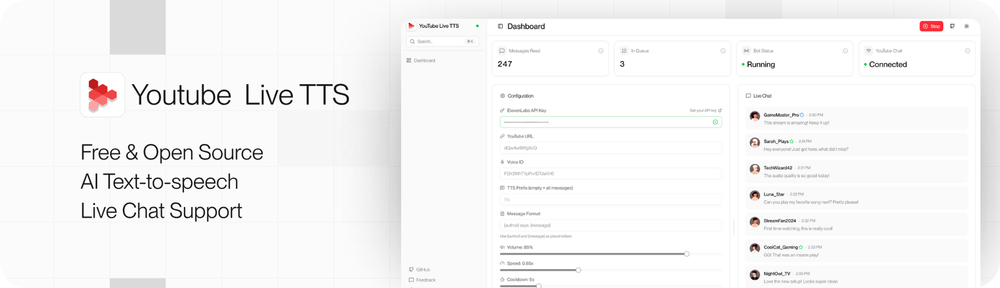

# YouTube Live TTS

Let your chat speak for itself. Real-time text-to-speech for YouTube live streams, powered by ElevenLabs.

<picture>
  <source media="(prefers-color-scheme: dark)" srcset="frontend/public/cover-dark.png">
  <source media="(prefers-color-scheme: light)" srcset="frontend/public/cover-light.png">
  
</picture>

## Features

- **Real-time chat monitoring:**  Watch messages flow in as they happen
- **AI-powered voices:** High-quality TTS with ElevenLabs or 60db, switchable from the dashboard
- **Modern web dashboard:** Configure and monitor from your browser
- **Customizable templates:** Set your own "{author} says: {message}" format
- **Smart message queue:** Prevents audio overlap
- **Anti-spam protection:** Per-user cooldowns and message length limits
- **Dark/Light theme:** System preference detection
- **i18n support:** English and Spanish
- **Cross-platform:** Windows, macOS and Linux

## Quick Start

### 1. Prerequisites

<details>
<summary><b>macOS</b></summary>

```bash
# Python
brew install python@3.12

# Bun
brew install oven-sh/bun/bun
```

</details>

<details>
<summary><b>Linux</b></summary>

```bash
# Ubuntu/Debian
sudo apt install python3 python3-pip libportaudio2 libsndfile1
curl -fsSL https://bun.com/install | bash

# Fedora
sudo dnf install python3 python3-pip portaudio libsndfile
curl -fsSL https://bun.com/install | bash
```

</details>

<details>
<summary><b>Windows</b></summary>

```powershell
# Python (via winget)
winget install Python.Python.3.12

# Bun
powershell -c "irm bun.sh/install.ps1 | iex"
```

</details>

### 2. Install

```bash
git clone https://github.com/emiliioaguirre/youtube-live-tts.git
cd youtube-live-tts

pip3 install -r backend/requirements.txt
cd frontend && bun install && cd ..
```

### 3. Run

```bash
bun dev
```

## TTS Providers

The bot speaks through a pluggable TTS provider, selectable from the dashboard:

- **ElevenLabs** (default) — enter your API key and voice ID directly in the dashboard.
- **60db** — set `SIXTYDB_API_KEY` in the backend environment (e.g. `backend/.env`),
  then pick **60db** in the dashboard and paste a 60db voice ID. The dashboard shows
  whether the server key is detected. Optional overrides: `SIXTYDB_WS_URL`,
  `SIXTYDB_VOICE_ID`, `SIXTYDB_SAMPLE_RATE` (see `backend/.env.example`).

Both providers are interchangeable behind a common interface (`backend/services/providers/`),
so the rest of the app doesn't care which one is active.

## Built With

- [pytchat](https://github.com/taizan-hokuto/pytchat) - Open-source python tchat for basic text communications
- [ElevenLabs](https://elevenlabs.io) - AI Text-to-Speech
- [60db](https://60db.ai) - AI Text-to-Speech (alternative provider)
- [FastAPI](https://fastapi.tiangolo.com) - Python backend
- [Next.js](https://nextjs.org) - React framework
- [shadcn/ui](https://ui.shadcn.com) - UI components
- [Zustand](https://zustand-demo.pmnd.rs) - State management
- [Tailwind CSS](https://tailwindcss.com) - Styling

## Contributing

Contributions are welcome! Please read our [Contributing Guidelines](CONTRIBUTING.md) and [Code of Conduct](CODE_OF_CONDUCT.md).

## License

Apache License 2.0
